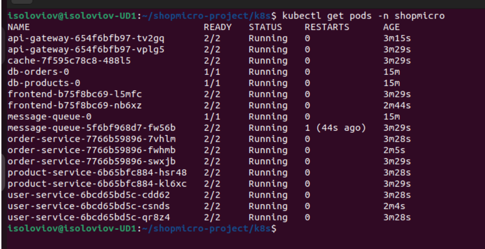
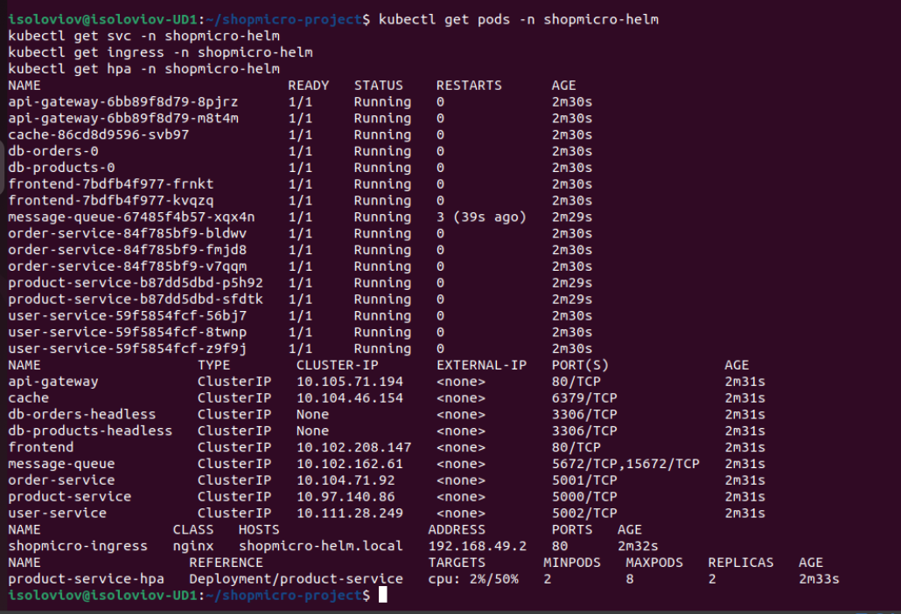
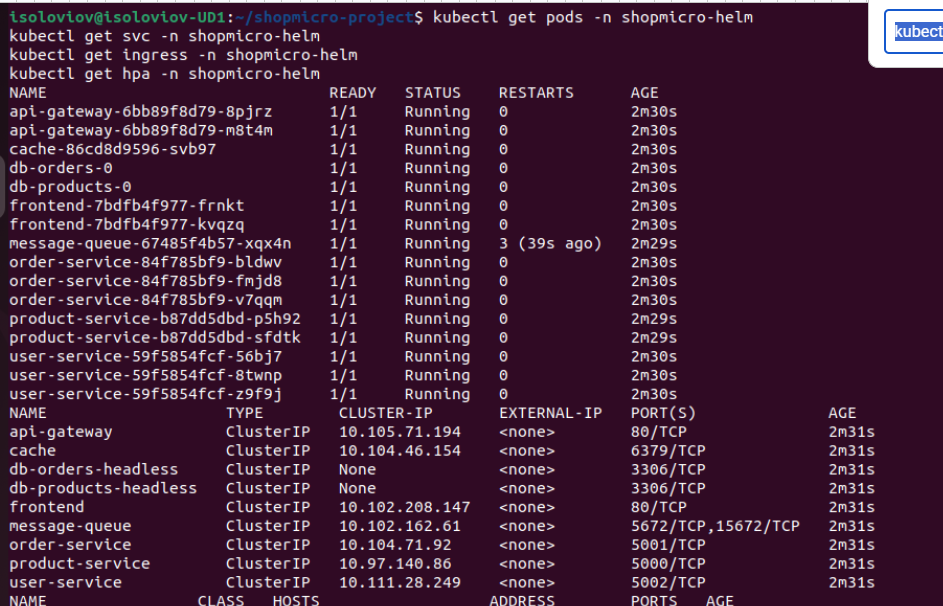

<div align="center">

<br/>

```
███████╗██╗  ██╗ ██████╗ ██████╗ ███╗   ███╗██╗ ██████╗██████╗  ██████╗ 
██╔════╝██║  ██║██╔═══██╗██╔══██╗████╗ ████║██║██╔════╝██╔══██╗██╔═══██╗
███████╗███████║██║   ██║██████╔╝██╔████╔██║██║██║     ██████╔╝██║   ██║
╚════██║██╔══██║██║   ██║██╔═══╝ ██║╚██╔╝██║██║██║     ██╔══██╗██║   ██║
███████║██║  ██║╚██████╔╝██║     ██║ ╚═╝ ██║██║╚██████╗██║  ██║╚██████╔╝
╚══════╝╚═╝  ╚═╝ ╚═════╝ ╚═╝     ╚═╝     ╚═╝╚═╝ ╚═════╝╚═╝  ╚═╝ ╚═════╝ 

         P l a t a f o r m a   d e   M i c r o s e r v e i s
              D o c k e r   →   S w a r m   →   K u b e r n e t e s
```

### Arquitectura cloud-native · Alta disponibilitat · Observabilitat total

*Helm · Istio Service Mesh · Prometheus · Grafana · HPA*

<br/>


<br/>

</div>

---

## 📋 Descripció del projecte

**ShopMicro** és una plataforma basada en microserveis desplegada sobre Kubernetes, dissenyada per simular un entorn real de producció amb alta disponibilitat, escalabilitat i monitorització completa.

El projecte segueix una evolució progressiva des d'un desplegament inicial amb **Docker Compose** fins a una arquitectura avançada amb **Kubernetes**, **Helm** i **Istio Service Mesh**, incorporant les eines i pràctiques pròpies dels entorns professionals actuals.

> **Cas d'ús:** La plataforma ha estat adaptada funcionalment com un **sistema de gestió d'incidències urbanes**, demostrant la versatilitat de l'arquitectura proposada.

---

##  Objectius principals

- 🐳 Crear un entorn multi-contenidor inicial amb Docker Compose
- 🐝 Migrar i orquestrar serveis amb Docker Swarm
- ☸️ Desplegar l'arquitectura completa a Kubernetes
- 🎛️ Empaquetar i gestionar el cicle de vida amb Helm
- 🕸️ Implementar control de trànsit avançat amb Istio
- 📊 Monitoritzar l'entorn amb Prometheus i Grafana
- 📈 Validar escalat automàtic amb HPA
- 🔒 Aplicar seguretat en cada capa del sistema

---

##  Arquitectura del sistema

```
┌──────────────────────────────────────────────────────┐
│                   CLIENT / NAVEGADOR                 │
└─────────────────────────┬────────────────────────────┘
                          │  HTTP
┌─────────────────────────▼────────────────────────────┐
│           INGRESS  ·  shopmicro.local                │
└─────────────────────────┬────────────────────────────┘
                          │
┌─────────────────────────▼────────────────────────────┐
│                    API GATEWAY                       │
└──────┬─────────────────┬──────────────────┬──────────┘
       │                 │                  │
┌──────▼──────┐  ┌───────▼───────┐  ┌──────▼──────────┐
│   product   │  │     order     │  │      user       │
│   service   │  │    service    │  │     service     │
└──────┬──────┘  └───────┬───────┘  └──────┬──────────┘
       │                 │                  │
┌──────▼─────────────────▼──────────────────▼──────────┐
│              MySQL  ·  Redis  ·  RabbitMQ             │
└──────────────────────────────────────────────────────┘
```

| Entorn | Comportament |
|---|---|
| 🐳 **Docker Compose** | Serveis en un únic host, validació inicial |
| 🐝 **Docker Swarm** | Orquestració distribuïda amb xarxes overlay |
| ☸️ **Kubernetes** | Objectes declaratius: Pods, Deployments, Services, Ingress, HPA |

### Components principals

| Component | Rol | Tecnologia |
|-----------|-----|------------|
| **Frontend** | Interfície web | Nginx |
| **API Gateway** | Punt central d'entrada i enrutament | Nginx / Custom |
| **product-service** | Gestió de productes / incidències | Microservei |
| **order-service** | Gestió de comandes / assignacions | Microservei |
| **user-service** | Gestió d'usuaris i autenticació | Microservei |
| **MySQL** | Persistència de dades | StatefulSet |
| **Redis** | Cache distribuïda | Deployment |
| **RabbitMQ** | Missatgeria asíncrona | Deployment |
| **Ingress** | Accés extern i TLS | Nginx Ingress |
| **Istio** | Control de trànsit i seguretat | Service Mesh |
| **Prometheus + Grafana** | Mètriques i visualització | Observabilitat |

---

##  Fases del projecte

### Fase 1 — Docker Compose

<details open>
<summary><b>Entorn multi-contenidor i validació funcional</b></summary>

<br/>

**Components desplegats:**

- 🌐 Frontend i API Gateway
- ⚙️ Microserveis: product, order, user
- 🗄️ MySQL com a base de dades
- ⚡ Redis com a cache
- 📨 RabbitMQ per a missatgeria
- 🔀 Xarxes separades per aïllament
- 💾 Volums persistents per a dades

**Comandes principals:**
```bash
docker compose up -d --build
docker ps
docker compose logs
docker compose down
```

</details>

---

### Fase 2 — Docker Swarm

<details>
<summary><b>Orquestració distribuïda i alta disponibilitat bàsica</b></summary>

<br/>

**Conceptes treballats:**

- 🔧 Inicialització del clúster Swarm
- 📦 Desplegament de stacks multi-servei
- 🔁 Serveis replicables i balanceig intern
- 🌐 Xarxes overlay distribuïdes
- 📈 Escalat horitzontal manual
- 🔄 Rolling updates i rollback automàtic
- 📊 Monitorització bàsica amb Prometheus

**Comandes principals:**
```bash
docker swarm init
docker node ls
docker stack deploy -c docker-stack.yml shopmicro
docker service ls
docker service scale shopmicro_product=3
docker service logs shopmicro_product
```

</details>

---

### Fase 3 — Kubernetes

<details>
<summary><b>Arquitectura cloud-native completa amb Minikube</b></summary>

<br/>

**Objectes implementats:**

- 📦 Deployments per cada microservei
- 🔌 Services (ClusterIP i NodePort)
- 🔑 Secrets per a credencials
- ⚙️ ConfigMaps per a configuració
- 🌍 Ingress Controller amb domini personalitzat
- 💓 Probes de salut (liveness / readiness)
- 📊 Requests i Limits de recursos
- 📈 Escalat manual i automàtic amb HPA

**Comandes principals:**
```bash
minikube start
kubectl get nodes
kubectl apply -f k8s/
kubectl get pods
kubectl get svc
kubectl scale deployment product-service --replicas=3
kubectl port-forward svc/nginx-service 8081:80
```

**Pods en execució:**



</details>

---

##  Kubernetes — Característiques avançades

### ⚖️ Escalat automàtic (HPA)

L'Horizontal Pod Autoscaler ajusta el nombre de rèpliques automàticament en funció de la càrrega de CPU:

```bash
kubectl autoscale deployment product-service \
  --cpu-percent=50 \
  --min=2 \
  --max=8
```

| Comportament | Descripció |
|---|---|
| **Scale-out** | Augment automàtic de pods sota càrrega elevada |
| **Scale-in** | Reducció automàtica en alliberar recursos de CPU |

**HPA creat i operatiu:**



**HPA en temps real (watch):**



---

### 🩺 Probes de salut

```yaml
livenessProbe:
  httpGet:
    path: /health
    port: 8080
  initialDelaySeconds: 10
  periodSeconds: 10

readinessProbe:
  httpGet:
    path: /ready
    port: 8080
  initialDelaySeconds: 5
  periodSeconds: 5
```

| Probe | Funció |
|---|---|
| **Liveness** | Reinici automàtic si el servei no respon |
| **Readiness** | Exclusió del trànsit fins que el servei estigui preparat |

---

### 📊 Gestió de recursos

```yaml
resources:
  requests:
    cpu: "100m"
    memory: "128Mi"
  limits:
    cpu: "500m"
    memory: "512Mi"
```

| Paràmetre | Funció |
|---|---|
| **requests** | Recursos mínims reservats pel scheduler |
| **limits** | Màxim de recursos que pot consumir el pod |

---

##  Helm — Gestió del desplegament

S'ha creat un **Helm Chart** complet per gestionar tot el cicle de vida del desplegament:

```bash
helm install shopmicro ./helm -n shopmicro-helm
```

**Instal·lació del Chart:**


**Release instal·lat i operatiu:**


| Funcionalitat | Descripció |
|---|---|
| **Parametrització** | Configuració centralitzada via `values.yaml` |
| **Deploy complet** | Desplegament de tot el sistema amb una sola comanda |
| **Upgrade sense downtime** | Actualitzacions sense interrupció del servei |
| **Historial de versions** | Rollback a qualsevol versió anterior |

---

##  Istio Service Mesh

### Funcionalitats implementades

| Funcionalitat | Descripció |
|---|---|
| **Sidecar Envoy** | Proxy injectat automàticament a cada pod |
| **Control de trànsit** | Enrutament avançat entre serveis |
| **Timeout** | Límit de 3 segons per petició |
| **Retries** | Fins a 3 reintents automàtics en cas de fallada |
| **Circuit Breaker** | Protecció davant cascades de fallades |
| **Kiali** | Visualització del graf de serveis en temps real |

### Exemple VirtualService

```yaml
apiVersion: networking.istio.io/v1alpha3
kind: VirtualService
metadata:
  name: product-service
spec:
  http:
    - timeout: 3s
      retries:
        attempts: 3
        perTryTimeout: 1s
      route:
        - destination:
            host: product-service
```

**Pods amb Istio aplicat:**


**VirtualService actiu:**


**Kiali — Graf de serveis:**


---

##  Monitorització

### Prometheus

- Recollida de mètriques dels serveis
- Monitorització de CPU, memòria i latència
- Integració amb Kubernetes Service Discovery

### Grafana

- Visualització de mètriques en temps real
- Dashboards personalitzats per cada servei
- Observació de patrons d'escalat i càrrega

**Dashboard Grafana — Visió general:**


**Dashboard Grafana — Detall de serveis:**


---

##  Accés a l'aplicació

### 🐳 Docker Compose

```bash
docker compose up -d --build
```

> 🌐 **http://localhost:8080/**

---

### ☸️ Kubernetes amb port-forward

```bash
kubectl port-forward svc/nginx-service 8081:80
```

> 🌐 **http://127.0.0.1:8081/**

---

### 🌍 Kubernetes amb Ingress

Domini: `shopmicro.local`

```bash
# Activar l'Ingress Controller
minikube addons enable ingress
minikube tunnel

# Afegir el domini a /etc/hosts
echo "$(minikube ip) shopmicro.local" | sudo tee -a /etc/hosts
```

> 🌐 **http://shopmicro.local/**

**Aplicació accessible via Ingress:**


Routing configurat:

| Ruta | Destí |
|---|---|
| `/` | Frontend |
| `/api/*` | API Gateway |

---

## 📁 Estructura del repositori

```
02-microservices-avanzado/
│
├── 📁 compose/           # Docker Compose (fase inicial)
│   ├── docker-compose.yml
│   └── services/
│
├── 📁 swarm/             # Docker Swarm (orquestració)
│   └── docker-stack.yml
│
├── 📁 k8s/               # Manifests Kubernetes
│   ├── deployments/
│   ├── services/
│   ├── configmaps/
│   ├── secrets/
│   ├── ingress/
│   └── hpa/
│
├── 📁 helm/              # Helm Chart complet
│   ├── Chart.yaml
│   ├── values.yaml
│   └── templates/
│
├── 📁 istio/             # Configuració del Service Mesh
│   ├── virtualservices/
│   └── destinationrules/
│
├── 📁 images/            # Captures d'evidències
└── 📁 docs/              # Documentació tècnica
```

---

##  Seguretat aplicada

| Mesura | Descripció |
|---|---|
| 🔑 **Kubernetes Secrets** | Credencials xifrades per a bases de dades i serveis |
| 🌐 **Namespaces** | Aïllament lògic entre entorns i components |
| 🚫 **Exposició mínima** | Només l'Ingress és accessible externament |
| 👤 **Usuari no privilegiat** | Contenidors executats sense permisos root |
| 🔒 **TLS automàtic** | Comunicació xifrada entre nodes amb Istio mTLS |

---

## 🔧 Problemes detectats i solucions

<details>
<summary><b>❌ ImagePullBackOff en Kubernetes</b></summary>

<br/>

**Causa:** La imatge no estava disponible dins de Minikube.

**Solució:**
```bash
minikube image load <nom-de-la-imatge>
```

</details>

<details>
<summary><b>❌ Error MySQL — Access denied</b></summary>

<br/>

**Causa:** Variables d'entorn mal configurades o Secrets incorrectes.

**Solució:**
```yaml
env:
  - name: MYSQL_ROOT_PASSWORD
    valueFrom:
      secretKeyRef:
        name: db-secret
        key: root-password
```

</details>

<details>
<summary><b>❌ NodePort no accessible amb Minikube</b></summary>

<br/>

**Causa:** Limitació del driver Docker de Minikube en Linux.

**Solució:**
```bash
kubectl port-forward svc/nginx-service 8081:80
```

</details>

---

##  Comparativa de tecnologies

| Tecnologia | ✅ Avantatges | ⚠️ Limitacions |
|---|---|---|
| 🐳 **Docker Compose** | Simple, ràpid, útil per a validació local | No distribuït ni escalable |
| 🐝 **Docker Swarm** | Orquestració senzilla, rèpliques i load balancing | Menys flexible que Kubernetes |
| ☸️ **Kubernetes** | Escalable, robust, estàndard de producció | Complexitat de configuració inicial |
| 🎛️ **Helm** | Gestió declarativa del cicle de vida | Corba d'aprenentatge addicional |
| 🕸️ **Istio** | Control de trànsit i observabilitat avançada | Overhead de recursos per sidecar |

---

##  Conclusions

**ShopMicro** demostra la implementació completa d'una arquitectura de microserveis real sobre Kubernetes, integrant les eines i pràctiques pròpies dels entorns professionals:

- **Escalabilitat** garantida amb HPA i Deployments declaratius
- **Resiliència** gràcies a probes de salut, retries i circuit breakers
- **Observabilitat** total amb Prometheus, Grafana i Kiali
- **Gestió del cicle de vida** simplificada amb Helm
- **Control avançat del trànsit** amb Istio Service Mesh

El resultat és una plataforma robusta, funcional i propera als estàndards reals de producció cloud-native.

---

<div align="center">

*Projecte desenvolupat com a pràctica avançada d'orquestració de contenidors*

**Docker Compose → Docker Swarm → Kubernetes → Helm → Istio**

</div>
