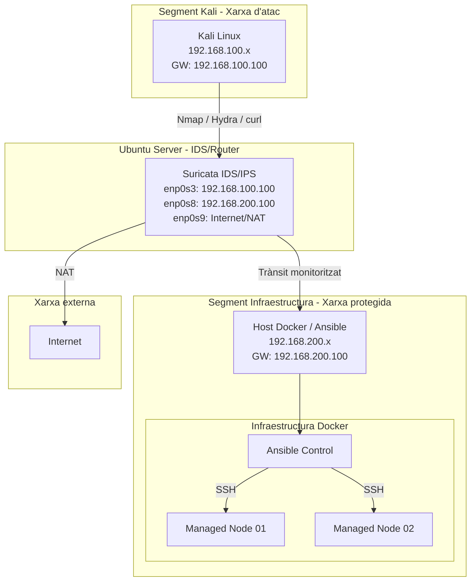

<div align="center">

<br/>

```
██████╗ ██████╗  ██████╗      ██╗███████╗ ██████╗████████╗███████╗
██╔══██╗██╔══██╗██╔═══██╗     ██║██╔════╝██╔════╝╚══██╔══╝██╔════╝
██████╔╝██████╔╝██║   ██║     ██║█████╗  ██║        ██║   █████╗  
██╔═══╝ ██╔══██╗██║   ██║██   ██║██╔══╝  ██║        ██║   ██╔══╝  
██║     ██║  ██║╚██████╔╝╚█████╔╝███████╗╚██████╗   ██║   ███████╗
╚═╝     ╚═╝  ╚═╝ ╚═════╝  ╚════╝ ╚══════╝ ╚═════╝   ╚═╝   ╚══════╝

        I D S / I P S   i   A u t o m a t i t z a c i ó   a m b   A n s i b l e
              A n s i b l e   →   I n f r a e s t r u c t u r a   →   S u r i c a t a
```

### Projecte IDS/IPS i Automatització amb Ansible

*Infraestructura automatitzada · Monitorització de seguretat · Resposta activa*

<br/>


<br/>

</div>

Aquest repositori recull un projecte integrat d'administració de sistemes i ciberseguretat format per dues parts relacionades entre si:

1. **Automatització d'infraestructura amb Ansible i Docker**
2. **Monitorització i protecció de xarxa amb Suricata IDS/IPS**

L'objectiu principal és crear un laboratori tècnic on es desplega una infraestructura automatitzada i, posteriorment, es monitoritza el trànsit generat mitjançant un sistema IDS/IPS basat en Suricata, Elastic Stack, Filebeat i regles de resposta activa amb iptables.

---

## Objectiu del projecte

El projecte busca simular un entorn realista on una infraestructura de serveis és desplegada automàticament i protegida mitjançant eines de detecció, anàlisi i resposta davant incidents.

Els objectius principals són:

- Automatitzar el desplegament i configuració de serveis amb Ansible.
- Crear un entorn de laboratori amb contenidors Docker.
- Implementar un IDS funcional amb Suricata.
- Detectar escaneigs, accessos sospitosos i intents de força bruta.
- Centralitzar logs i alertes amb Filebeat, Elasticsearch i Kibana.
- Aplicar mesures de resposta activa amb iptables.
- Documentar un pla de resposta a incidents.
- Relacionar automatització, monitorització i seguretat dins d’un mateix escenari.

---

## Relació entre els dos projectes

Aquest repositori no conté dos projectes aïllats, sinó dues parts complementàries d’una mateixa infraestructura.

La primera part, situada a `ansible-lab/`, desplega una infraestructura automatitzada amb Ansible i Docker. Aquesta infraestructura representa els sistemes o serveis que han de ser administrats.

La segona part, situada a `IDS_IPS/`, implementa el sistema de detecció i resposta de seguretat. Suricata analitza el trànsit entre segments de xarxa, genera alertes, envia logs a Elastic Stack i permet aplicar resposta activa mitjançant iptables.

D’aquesta manera, el projecte representa un cicle complet:

```text
Desplegament automatitzat → Generació de trànsit → Detecció IDS → Anàlisi de logs → Resposta activa
```

---

## Estructura del repositori

```text
Projecte-IDS-IPS-i-Automatitzacio-amb-Ansible/
├── ansible-lab/
│   ├── ansible/
│   ├── dockerfiles/
│   ├── inventory/
│   ├── docker-compose.yml
│   └── README.md
│
├── IDS_IPS/
│   ├── elastic/
│   ├── iptables/
│   ├── scripts/
│   ├── suricata/
│   ├── systemd/
│   └── README.md
│
├── diagrams/
│   ├── Infraestructura_Xarxa.png
│   └── Diagrama_PladeRespostaAIncidents.png
│
├── docs/
│   └── Pla_Resposta_Incidents.md
│
└── README.md
```

---

## Arquitectura general del laboratori

La infraestructura està dividida en diferents segments de xarxa per separar l’equip atacant, el sistema IDS i la infraestructura protegida.

| Component | Funció |
|---|---|
| Kali Linux | Simulació d’atacs i proves de seguretat |
| Ubuntu Server | Sistema IDS, router i firewall |
| Suricata | Motor IDS/IPS per analitzar trànsit |
| Host Docker | Infraestructura automatitzada amb Ansible |
| Ansible Control | Node de control d’Ansible |
| Managed Nodes | Nodes gestionats automàticament |
| Elasticsearch | Emmagatzematge i indexació de logs |
| Kibana | Visualització d’alertes i esdeveniments |
| Filebeat | Enviament de logs de Suricata cap a Elastic |
| iptables | NAT, firewall i resposta activa |

---

## Esquema de xarxa



---

## Part 1: Automatització amb Ansible

La carpeta `ansible-lab/` conté el laboratori d’automatització.

Aquesta part permet desplegar un node de control Ansible i diversos nodes gestionats utilitzant Docker. El node de control executa playbooks sobre els nodes gestionats mitjançant connexions SSH.

Funcionalitats principals:

- Creació d’un entorn Ansible dins Docker.
- Configuració d’un node de control.
- Creació de nodes gestionats Debian.
- Inventari d’Ansible configurat.
- Execució de playbooks.
- Automatització de serveis i configuracions.
- Validació de connectivitat entre contenidors.

Fitxers destacats:

```text
ansible-lab/docker-compose.yml
ansible-lab/ansible/setup_web.yml
ansible-lab/inventory/hosts
ansible-lab/dockerfiles/Dockerfile.ansible
ansible-lab/dockerfiles/Dockerfile.client
```

---

## Part 2: IDS/IPS amb Suricata

La carpeta `IDS_IPS/` conté la configuració del sistema de detecció i resposta.

Aquesta part implementa Suricata com a IDS principal del laboratori. El sistema analitza el trànsit entre la xarxa de Kali i la xarxa de la infraestructura, genera alertes i les envia cap a Elastic Stack mitjançant Filebeat.

Funcionalitats principals:

- Instal·lació i configuració de Suricata.
- Definició de variables de xarxa.
- Regles ET Open.
- Regles personalitzades.
- Detecció d’escaneigs amb Nmap.
- Detecció d’intents d’accés SSH.
- Detecció de força bruta amb Hydra.
- Detecció d’accessos a serveis web i ports sensibles.
- Enviament de logs `eve.json` cap a Elasticsearch.
- Visualització d’alertes amb Kibana.
- Sistema d’alerta temprana per correu electrònic.
- Resposta activa mitjançant iptables.

Fitxers destacats:

```text
IDS_IPS/suricata/suricata.yaml
IDS_IPS/suricata/local.rules
IDS_IPS/elastic/filebeat.yml
IDS_IPS/scripts/install_suricata.sh
IDS_IPS/scripts/install_elastic_stack.sh
IDS_IPS/scripts/suricata-alert.sh
IDS_IPS/systemd/suricata-alert.service
IDS_IPS/iptables/rules.v4
```

---

### Configuració de Routing i NAT

Per permetre la comunicació entre les dues xarxes internes i proporcionar accés a Internet als sistemes del laboratori, el servidor Ubuntu amb Suricata es configura com a **router amb NAT**.

Aquest sistema disposa de tres interfícies:

| Interfície | Xarxa | Funció |
|-------------|------|--------|
| enp0s3 | 192.168.100.0/24 | Segment Kali |
| enp0s8 | 192.168.200.0/24 | Segment infraestructura |
| enp0s9 | Xarxa externa | Sortida a Internet |

Les dues xarxes internes utilitzen el servidor IDS com a **gateway**:

- Kali → 192.168.100.100
- Infraestructura → 192.168.200.100

---

### Activació d’IP Forwarding

Per permetre que el sistema actuï com a router es necessita activar el forwarding IP.

Fitxer:

```text
/etc/sysctl.conf
```

Configuració:

```bash
net.ipv4.ip_forward=1
```

Aplicar configuració:

```bash
sudo sysctl -p
```

---

### Configuració IPTABLES

Per permetre la comunicació entre les xarxes internes i proporcionar accés a Internet als sistemes del laboratori, el servidor Ubuntu amb Suricata es configura com a **router amb NAT utilitzant iptables**.

Inicialment les regles es van aplicar manualment amb `iptables`, però aquestes **no són persistents** i es perden després de reiniciar el sistema. Per aquest motiu es va configurar la persistència utilitzant el paquet `iptables-persistent`.

---

### Regla NAT sortida a Internet

La següent regla permet que els hosts de les xarxes internes surtin a Internet utilitzant la IP externa del servidor IDS.

```bash
sudo iptables -t nat -A POSTROUTING -o enp0s9 -j MASQUERADE
```

La interfície `enp0s9` és la que proporciona la connexió cap a Internet.

---

### Regles de Forwarding

Encara que el forwarding ja està habilitat amb `ip_forward`, es defineixen explícitament les regles per permetre el trànsit entre les xarxes internes i Internet.

Permetre que les xarxes internes surtin a Internet:

```bash
sudo iptables -A FORWARD -i enp0s3 -o enp0s9 -j ACCEPT
sudo iptables -A FORWARD -i enp0s8 -o enp0s9 -j ACCEPT
```

Permetre el retorn de connexions establertes des d’Internet:

```bash
sudo iptables -A FORWARD -i enp0s9 -o enp0s3 -m state --state RELATED,ESTABLISHED -j ACCEPT
sudo iptables -A FORWARD -i enp0s9 -o enp0s8 -m state --state RELATED,ESTABLISHED -j ACCEPT
```

---

### Persistència de les regles

Per evitar que les regles es perdin després de reiniciar la màquina virtual es va instal·lar el paquet:

```bash
sudo apt install iptables-persistent
```

Aquest paquet guarda les regles dins del fitxer:

```text
/etc/iptables/rules.v4
```

En aquest projecte, després d’un reinici de la màquina virtual, les regles es van afegir manualment en aquest fitxer per garantir que el sistema continuï funcionant com a router després de cada arrencada.

Exemple de configuració dins del fitxer:

```text
*nat
:PREROUTING ACCEPT [0:0]
:INPUT ACCEPT [0:0]
:OUTPUT ACCEPT [0:0]
:POSTROUTING ACCEPT [0:0]

-A POSTROUTING -o enp0s9 -j MASQUERADE

COMMIT


*filter
:INPUT ACCEPT [0:0]
:FORWARD ACCEPT [0:0]
:OUTPUT ACCEPT [0:0]

-A FORWARD -i enp0s3 -o enp0s9 -j ACCEPT
-A FORWARD -i enp0s8 -o enp0s9 -j ACCEPT
-A FORWARD -i enp0s9 -o enp0s3 -m state --state RELATED,ESTABLISHED -j ACCEPT
-A FORWARD -i enp0s9 -o enp0s8 -m state --state RELATED,ESTABLISHED -j ACCEPT

COMMIT
```

Després de modificar el fitxer es poden aplicar les regles amb:

```bash
sudo netfilter-persistent reload
```

---

### Funcionament del Routing i NAT

Amb aquesta configuració:

- Kali i la infraestructura poden comunicar-se entre elles.
- Els hosts interns poden accedir a Internet.
- Tot el trànsit passa pel servidor IDS.
- Suricata pot analitzar el trànsit entre segments.
- Les regles de xarxa es mantenen després de reiniciar el sistema.

Aquest model permet centralitzar la monitorització de xarxa i facilita la detecció d’activitats sospitoses dins del laboratori.

---

### Resposta activa amb iptables

A més de detectar trànsit sospitós, el projecte incorpora un sistema de resposta activa.

Quan Suricata detecta determinades activitats, el sistema pot aplicar bloquejos temporals mitjançant iptables. Per això s’utilitza una cadena específica anomenada:

```text
SURICATA_BLOCK
```

Aquest mecanisme permet:

- Bloquejar IPs atacants.
- Aplicar bloquejos temporals.
- Reduir l’impacte d’escaneigs o atacs repetits.
- Complementar el funcionament IDS amb una resposta similar a un IPS.
- Registrar les accions aplicades.

Aquest model no substitueix un IPS empresarial complet, però permet implementar una resposta activa funcional dins del laboratori.

---

### Elastic Stack i visualització

Els logs generats per Suricata es guarden principalment al fitxer:

```text
/var/log/suricata/eve.json
```

Filebeat s’encarrega d’enviar aquests logs cap a Elasticsearch. Posteriorment, Kibana permet visualitzar els esdeveniments de seguretat, filtrar alertes i validar les deteccions generades durant les proves.

Flux de logs:

```text
Suricata → eve.json → Filebeat → Elasticsearch → Kibana
```

---

## Proves realitzades

Durant el projecte s’han realitzat diverses proves per validar el funcionament del sistema.

Exemples de proves:

- Escaneig de ports amb Nmap.
- Simulació de força bruta SSH amb Hydra.
- Accessos HTTP amb curl.
- Validació de regles personalitzades de Suricata.
- Comprovació de logs a `fast.log` i `eve.json`.
- Visualització d’alertes a Kibana.
- Validació d’enviament d’alertes per correu.
- Validació de bloquejos temporals amb iptables.
- Comprovació de persistència de regles amb `iptables-persistent`.

---

## Tecnologies utilitzades

| Tecnologia | Ús dins del projecte |
|---|---|
| Ansible | Automatització de configuracions |
| Docker | Creació del laboratori de nodes |
| Suricata | Sistema IDS/IPS |
| Filebeat | Enviament de logs |
| Elasticsearch | Emmagatzematge i indexació |
| Kibana | Visualització d’alertes |
| iptables | Firewall, NAT i resposta activa |
| Postfix | Enviament d’alertes per correu |
| ClamAV | Antivirus complementari |
| Kali Linux | Simulació d’atacs |
| Ubuntu Server | Sistema IDS/router |
| VirtualBox | Virtualització del laboratori |

---

## Estat final del projecte

El projecte queda dividit en tres blocs funcionals:

### Automatització

- Node de control Ansible funcional.
- Nodes gestionats operatius.
- Inventari configurat.
- Playbooks funcionant.
- Infraestructura Docker desplegada.
- Serveis configurats de forma automatitzada.

### Detecció i monitorització

- Suricata configurat i funcional.
- Regles ET Open carregades.
- Regles personalitzades creades.
- Logs generats a `eve.json` i `fast.log`.
- Filebeat enviant logs a Elasticsearch.
- Alertes visibles a Kibana.
- Detecció validada amb proves reals.

### Resposta i seguretat

- NAT i routing configurats.
- Regles iptables persistents.
- Cadena `SURICATA_BLOCK` implementada.
- Bloqueig temporal d’IPs atacants.
- Alertes per correu electrònic.
- ClamAV com a sistema complementari.
- Pla de resposta a incidents documentat.

---

## Documentació complementària

El repositori inclou documentació addicional per ampliar la informació tècnica del projecte.

```text
docs/
├── Pla_Resposta_Incidents.md
```

També s’inclouen diagrames visuals de la infraestructura i del pla de resposta:

```text
diagrams/
├── Infraestructura_Xarxa.png
└── Diagrama_PladeRespostaAIncidents.png
```

---

## Com executar cada part

### Laboratori Ansible

Accedir a la carpeta:

```bash
cd ansible-lab
```

Desplegar l’entorn:

```bash
docker compose up -d --build
```

Entrar al node de control:

```bash
docker exec -it ansible-control bash
```

Validar connexió amb els nodes:

```bash
ansible all -i inventory/hosts -m ping
```

Executar el playbook:

```bash
ansible-playbook -i inventory/hosts ansible/setup_web.yml
```

---

### Sistema IDS/IPS

Accedir a la carpeta:

```bash
cd IDS_IPS
```

Instal·lar Suricata:

```bash
sudo bash scripts/install_suricata.sh
```

Instal·lar Elastic Stack:

```bash
sudo bash scripts/install_elastic_stack.sh
```

Comprovar l’estat de Suricata:

```bash
sudo systemctl status suricata
```

Validar alertes:

```bash
sudo tail -f /var/log/suricata/fast.log
```

Validar logs EVE:

```bash
sudo tail -f /var/log/suricata/eve.json
```

---

## Valoració final

Aquest projecte permet demostrar competències en administració de sistemes, automatització, xarxes i ciberseguretat.

La part d’Ansible mostra com es pot desplegar i gestionar infraestructura de manera automatitzada. La part de Suricata permet aplicar monitorització de seguretat, detecció d’atacs, anàlisi de logs i resposta activa.

La integració de totes dues parts converteix el laboratori en un entorn complet, on no només es despleguen serveis, sinó que també es protegeixen, es monitoritzen i es documenten segons un pla de resposta a incidents.

---

## Autor

**Jan Garcia**

Projecte desenvolupat com a pràctica d’ASIX2, combinant administració de sistemes, automatització i ciberseguretat.
